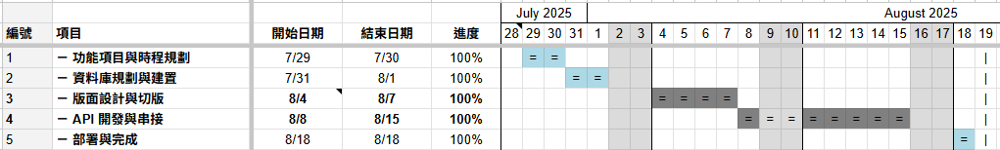
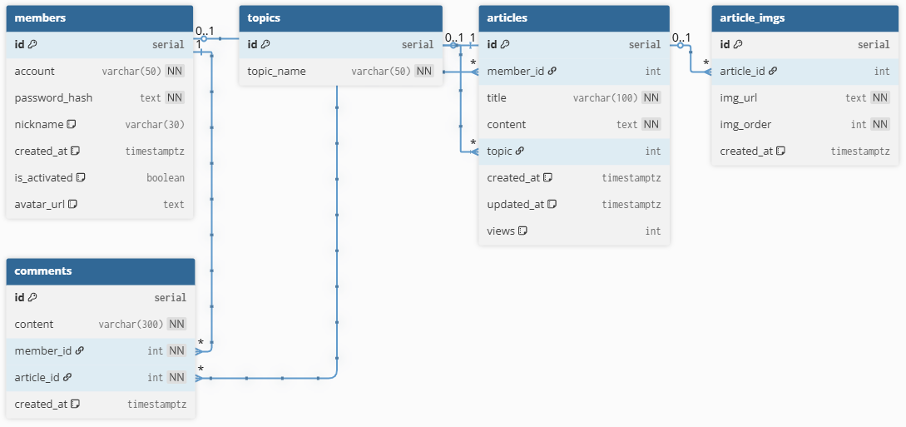

# 專案開發訓練 - My Blog by Caitlyn Wu

---

## 0. 項目與時程規劃
- 開發總時程約三週
- 專案管理使用 Google Sheet + 甘特圖套件



---

## 1. 使用技術
### - 前端：
- React v19
- Next.js v15 (App Router)
- TypeScript

### - 後端與資料庫：
- Node v22
- Express
- ORM: Prisma
- PostgreSQL (使用 Docker 運行)
- RESTful 風格 api

並皆以 `ESM` 模式開發。
```json lines
// package.json
{
    "type": "module",
}
```

### - UI / UX：
- UI 框架：Tailwind v4
- UI Library：DaisyUI v5
- UI / UX 設計：Figma

---

## 2. 專案結構
- 前端：
    ```txt
    caitlyn-training\project-training-my-blog-frontend
    ├── app
    |  ├── globals.css
    |  ├── layout.tsx
    |  ├── login
    |  |  └── page.tsx
    |  ├── page.tsx
    |  ├── posts
    |  |  ├── edit
    |  |  |  └── [id]
    |  |  ├── new-post
    |  |  |  ├── page.tsx
    |  |  |  └── _components
    |  |  ├── page.tsx
    |  |  ├── [id]
    |  |  |  ├── page.tsx
    |  |  |  └── _components
    |  |  └── _components
    |  |     └── Article-list-card.tsx
    |  ├── profile
    |  |  ├── page.tsx
    |  |  └── _components
    |  |     ├── My-comments-list-card.tsx
    |  |     ├── My-comments.tsx
    |  |     ├── My-posts-list-card.tsx
    |  |     ├── My-posts.tsx
    |  |     └── Tabs.tsx
    |  ├── register
    |  |  └── page.tsx
    |  ├── schemas
    |  |  ├── login-schema.tsx
    |  |  ├── new-comment-schema.tsx
    |  |  ├── new-post-schema.tsx
    |  |  └── register-schema.tsx
    |  └── _components
    |     ├── Article-card.tsx
    |     ├── Comment-card.tsx
    |     ├── DropDown.tsx
    |     ├── Footer.tsx
    |     ├── Navbar.tsx
    |     ├── Pagination.tsx
    |     ├── Search-bar.tsx
    |     └── To-top.tsx
    ├── context
    |  └── Auth-context.tsx
    ├── daisyui.d.ts
    ├── next-env.d.ts
    ├── next.config.mjs
    ├── package-lock.json
    ├── package.json
    ├── postcss.config.mjs
    ├── public
    |  ├── favicon.ico
    |  └── imgs
    |     ├── article-default.webp
    |     ├── avatar-default.png
    |     ├── logo.png
    |     └── logo2.png
    ├── tailwind.config.ts
    ├── tsconfig.json
    └── utils
       └── LocaleDateTimeTransfer.tsx
    ```
  
- 後端：
    ```txt
    caitlyn-training\project-training-my-blog-backend
    ├── eslint.config.mjs
    ├── index.d.ts
    ├── package-lock.json
    ├── package.json
    ├── prisma
    |  ├── migrations
    |  └── schema.prisma
    ├── src
    |  ├── auth-jwt.ts
    |  └── index.ts
    ├── tsconfig.json
    └── uploads
       ├── article-imgs
       └── avatars
    ```
  
---

## 3. 資料庫設計

- 使用 PostgreSQL 關連式資料庫設計



---

## 4. 部署方式
- 前端：使用 `npm run dev` 以 Next.js 在本機執行。
- 後端：使用 `npm run dev` 並使用 `dotenv` 搭配 `.env` 以 Nodemon 在本機執行。
```dotenv
# .env
DATABASE_URL=
PORT=

JWT_KEY=
```
```json lines
// package.json
{
    "scripts": {
      "dev": "nodemon --exec \"node --loader ts-node/esm\" src/index.ts",
    }
}
```

---

## 5. 主要功能
- 首頁
  - 最新 9 篇文章
  - 最新 4 篇留言
- 文章列表
  - 篩選主題
  - 搜尋文章標題或作者
  - 分頁
- 單篇文章
  - 留言區
    - 留言列表
    - （登入後）發表留言
    - （登入後）刪除自己的留言
  - 同作者最新 5 篇文章
  - 同主題最新 5 篇文章
- 發表文章
- 會員中心
  - 更換大頭貼圖片
  - 我的文章
    - 篩選主題
    - 搜尋文章標題
    - 編輯文章
    - 刪除文章
    - 分頁
  - 我的留言
    - 搜尋留言內容或文章標題
    - 刪除留言
    - 分頁

---

## 6. API 一覽
| 編號  | Router                    | Method    | 說明             |
|:---:|---------------------------|-----------|----------------|
|  1  | /api                      | GET       | 首頁資料           |
|  2  | /api/register             | POST      | 會員註冊           |
|  3  | /api/login                | POST      | 會員登入           |
|  4  | /api/profile              | GET       | 會員中心資料         |
|  5  | /api/upload-avatar        | POST      | 上傳並更換會員大頭貼圖片   |
|  6  | /api/upload-article-img   | POST      | 上傳文章圖片         |
|  7  | /api/posts/new-post       | POST      | 新增文章           |
|  8  | /api/posts                | GET       | 文章列表資料         |
|  9  | /api/posts/:id            | GET       | 單篇文章資料         |
| 10  | /api/posts/edit/:id       | PUT       | 編輯（更新）文章       |
| 11  | /api/posts/delete-post    | DELETE    | 刪除單篇文章         |
| 12  | /api/posts/new-comment    | POST      | 新增留言           |
| 13  | /api/posts/delete-comment | DELETE    | 刪除留言           |
| 14  | /api/topics               | GET       | 拿主題列表          |